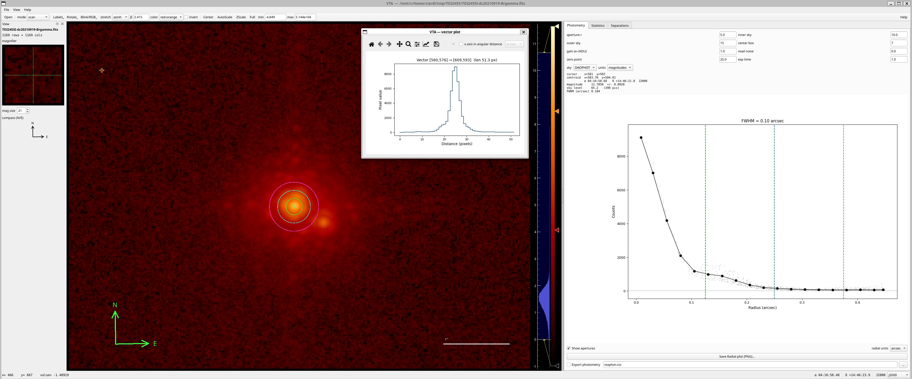
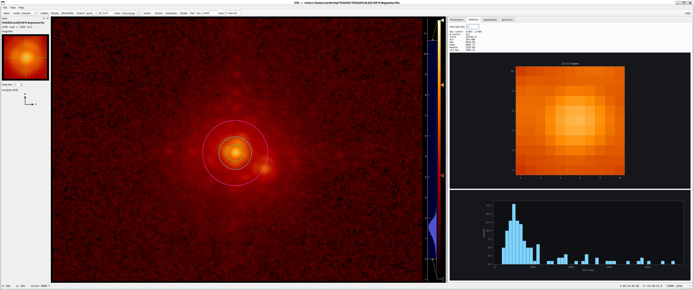
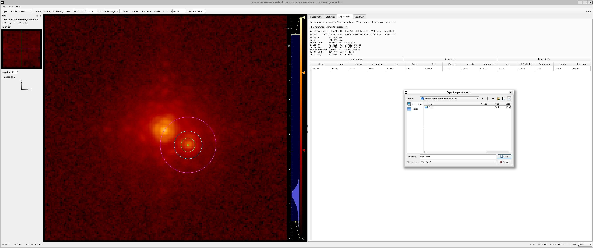
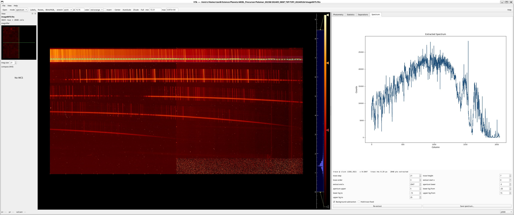

# VTA — Visualization Tool for Astronomy

A standalone desktop FITS image viewer for Python, built on
PySide6 + pyqtgraph + astropy. VTA is a modern reimplementation, in spirit,
of Aaron Barth's IDL **ATV**, aimed at quick interactive inspection of
astronomical images — display, photometry, source separations, and
spectral extraction in one window.



## Highlights

- Interactive FITS display with the usual stretches, scalings, and colormaps
- imexam-style aperture photometry with a live radial profile and FWHM
- Source-to-source separations with position angle and propagated errors
- Trace-and-extract spectral extraction
- Box statistics, row/column/vector cuts, blink/RGB, WCS-aware overlays

## Features

- **Display:** FITS loading (multi-extension, primary-header inheritance),
  3-D cube stepping with median/average combining, zoom / pan / recenter,
  an adjustable image/analysis splitter, magnifier, and an always-on N/E
  compass.
- **Stretches & scaling:** linear, log, sqrt, asinh (adjustable β),
  histogram equalization; AutoScale / ZScale / Full / manual limits.
- **Color:** red-orange (default), red-white, grey, blue-white, plus
  viridis/inferno/magma/cividis/turbo and rainbow, with inversion and
  mouse brightness/contrast.
- **Coordinates:** cursor readout in J2000 (sexagesimal or degrees),
  B1950, Galactic, Ecliptic, or pixels.
- **Analysis tabs:** Photometry, Statistics, Separations, and Spectrum
  (described below).
- **Cuts:** independent row / column / arbitrary-vector cut windows, with
  an optional angular (arcsec/arcmin/degree) x-axis.
- **Annotation & manipulation:** arrows, compass, scale bar, contours;
  WCS-preserving rotations/flips; blink buffers (with a click-through Blink
  mode) and RGB composites; FITS / spectrum / plot saving.

## The analysis tabs

### Photometry

ATV/DAOPHOT aperture photometry with centroiding. The radial profile and
FWHM can be shown in pixels or arcsec (when a celestial WCS is present),
the aperture/sky circles can be toggled on the image, and measurements can
be logged to a CSV file.


### Statistics

Box statistics around the cursor (total, min/max, mean, median, σ), a
rendered subimage, and a pixel-value histogram.



### Separations

imexam one source as a reference, then another as a target, to get the
pixel offsets, on-sky ΔRA/ΔDec, total separation, position angle (East of
North), and Δmag — each with propagated uncertainties from the centroid
S/N — accumulated into a table and exportable to CSV.



### Spectrum

Click a trace in `spectrum` mode to trace and extract a 1-D spectrum (a
port of ATV's `atvextract`): iterative trace centroiding, polynomial trace
fit, partial-pixel aperture summation, and background subtraction. All
extraction parameters are editable in the tab and re-extract live; the
result can be saved as 1-D FITS or text.



## Installation

VTA needs Python 3.10+ and the packages in `requirements.txt`.

```bash
git clone https://github.com/ciardi/vta.git
cd vta
python -m pip install -r requirements.txt
```

On Linux you may also need the Qt xcb system libraries, e.g. on
Debian/Ubuntu:

```bash
sudo apt install libxcb-cursor0
```

## Usage

```bash
python vta.py                # open with no image
python vta.py image.fits     # open a FITS file directly
```

In the GUI, see **Help ▸ VTA help** (or press **F1**) for the full guide.
Pick an interaction **mode** from the toolbar pulldown (scan, color, zoom,
imexam, vector, row, col, spectrum, blink) and click on the image.

## Status

VTA is in active development and provided as-is. Bug reports and feature
requests are welcome via the Issues tab.

## Heritage & credits

Heritage: **ATV** by Aaron Barth. VTA is an independent Python
reimplementation and is not affiliated with or derived from the ATV source
code; it reimplements comparable functionality and ports several of ATV's
algorithms (centroiding, aperture photometry, spectral tracing).

Author: David R. Ciardi.

## License

Released under the MIT License — see [LICENSE](LICENSE).
